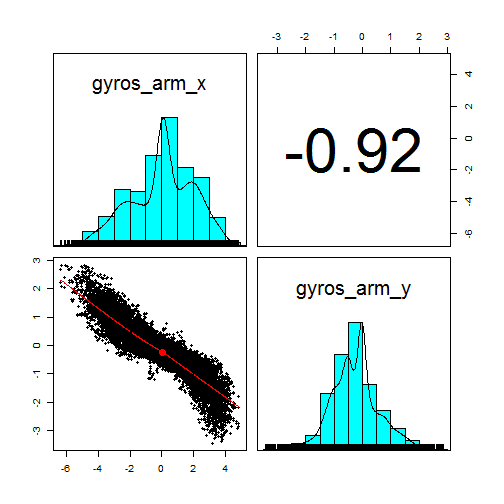
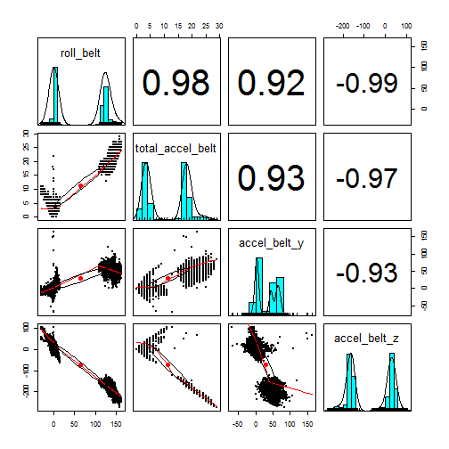
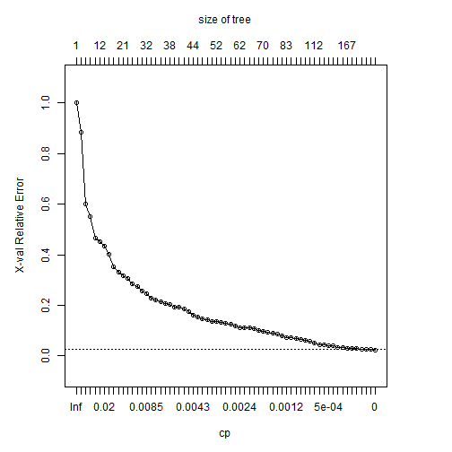
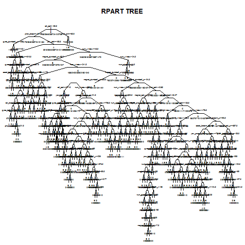

<!-- # Databases source:: Velloso, E.; Bulling, A.; Gellersen, H.; Ugulino, W.; Fuks, H. Qualitative Activity Recogniti#on of Weight Lifting Exercises. Proceedings of 4th International Conference in Cooperation #with SIGCHI (Augmented Human '13) . Stuttgart, Germany: ACM SIGCHI, 2013. Read more: http://groupware.les.inf.puc-rio.br/har#ixzz3MGRd7WU2 -->

#### Tittle: Activity Recognition of Weight Lifting Exercises

### Summary
This report presents the proccess followed to generate a CART rpart Clssification model for Activity Recognition of Weight Lifting Exercises, with final results obteined after apllying the model into out-sample data set. Cros Validation was use to build diferent Decission trees and lower xvalidation error rate tree was selected.

*Databases source:
Velloso, E.; Bulling, A.; Gellersen, H.; Ugulino, W.; Fuks, H. Qualitative Activity Recogniti#on of Weight Lifting Exercises. Proceedings of 4th International Conference in Cooperation #with SIGCHI (Augmented Human '13) . Stuttgart, Germany: ACM SIGCHI, 2013. 

Read more: http://groupware.les.inf.puc-rio.br/har#ixzz3MGRd7WU2

The data for this project come from this source: http://groupware.les.inf.puc-rio.br/har


```r
library(caret); library(rpart); library(xtable); library(psych)

# Working Environment & Data Load
# setwd(".../EDX & Coursera training/Practical Machine Learning/Project")
myData <- read.csv("pml-training.csv", sep = ",")
```

#### Clean & Exploratory Analysis
* Remove all variables with 19216 NA's or "" - 101 Variables removed from 160 to 59
* Remove 5 Non metrics variables X, user_name, raw_timestamp_part_1 & 2, cvtd_timestamp
* Need to Remove outliers - row 5373 presents strange values
* No Near Zero Variance variables - No need to remove addittional variables


```r
# Remove all variables with 19216 NA's or "" - 101 Variables removed from 160 to 59
myDataOpt <- myData[,-which(grepl("19216", summary(myData)[7,]) | 
                            grepl("19216", summary(myData)[1,]) ,
                            arr.ind=TRUE)]
# Remove 5 Non metrics variables X, user_name, raw_timestamp_part_1 & 2, cvtd_timestamp
myDataOpt <- myDataOpt[,-c(1:5)]
# Need to Remove outliers - row 5373 presents strange values - we consider an error and remove
myDataOpt <- myDataOpt[-5373,]
# No Near Zero Variance variables - No need to remove addittional variables
nearZeroVar(myDataOpt)
```

```
## integer(0)
```

* Correlation Analysis - Identifying variables with > 90% correlation


```r
matcorr <- abs(cor(myDataOpt[,-54]))
diag(matcorr) <- 0
list_var_corr <- which(matcorr > 0.9, arr.ind=TRUE, useNames=FALSE)
# Correlation table Analysis - Selected variables with > 90% correlation
corrTable <- data.frame(NULL)
for (ind in 1:nrow(list_var_corr)) { 
          corrTable <- rbind(corrTable, 
                             cbind(colnames(myDataOpt)[list_var_corr[ind,1]], 
                                    colnames(myDataOpt)[list_var_corr[ind,2]], 
                                    sprintf("%1.2f%%",
                                            matcorr[list_var_corr[ind,1], 
                                                    list_var_corr[ind,2]]*100 )
                                    ))
}

colnames(corrTable) <- c("Attribute1", "Attribute2", "Correlation")
print(corrTable)
```

```
##          Attribute1       Attribute2 Correlation
## 1  total_accel_belt        roll_belt      98.09%
## 2      accel_belt_y        roll_belt      92.49%
## 3      accel_belt_z        roll_belt      99.20%
## 4      accel_belt_x       pitch_belt      96.57%
## 5         roll_belt total_accel_belt      98.09%
## 6      accel_belt_y total_accel_belt      92.78%
## 7      accel_belt_z total_accel_belt      97.49%
## 8        pitch_belt     accel_belt_x      96.57%
## 9         roll_belt     accel_belt_y      92.49%
## 10 total_accel_belt     accel_belt_y      92.78%
## 11     accel_belt_z     accel_belt_y      93.34%
## 12        roll_belt     accel_belt_z      99.20%
## 13 total_accel_belt     accel_belt_z      97.49%
## 14     accel_belt_y     accel_belt_z      93.34%
## 15      gyros_arm_y      gyros_arm_x      91.82%
## 16      gyros_arm_x      gyros_arm_y      91.82%
```

##### Graphical Exploration of affected variables.


```r
pairs.panels(myDataOpt[,c(19,20)])
```

 

```r
pairs.panels(myDataOpt[,c(2,5,10,11)])
```

 

Initially, no filter of variables as per high correlation will be done.

#### Classification Model Analysis
DataSet splitted in 75% training & cv set, 25% testing set  

FIRST ANALYSYS:
We perform RPART classification on training set & Evaluate results.
No cross validation aplied.
PCA analysis done, although reduced acuracy of model. Thus not applied initially.   Details of PCA analysis done on code Rmd file


```r
set.seed(1234321)
inTrain=createDataPartition(y=myDataOpt$classe, p=0.75, list=FALSE)
training <- myDataOpt[inTrain,]
testing <- myDataOpt[-inTrain,]

set.seed(1234322)
myFit <- rpart(classe ~ ., data=training, method = "class")
myFitPred <- predict(myFit, testing, type=c("class"))
confusionMatrix(myFitPred, testing$classe)
```

```
## Confusion Matrix and Statistics
## 
##           Reference
## Prediction    A    B    C    D    E
##          A 1271  133   14   46    3
##          B   37  565   67   30   26
##          C    0   50  675   29    1
##          D   69  156   87  647  111
##          E   17   45   12   52  760
## 
## Overall Statistics
##                                           
##                Accuracy : 0.7991          
##                  95% CI : (0.7876, 0.8102)
##     No Information Rate : 0.2843          
##     P-Value [Acc > NIR] : < 2.2e-16       
##                                           
##                   Kappa : 0.7458          
##  Mcnemar's Test P-Value : < 2.2e-16       
## 
## Statistics by Class:
## 
##                      Class: A Class: B Class: C Class: D Class: E
## Sensitivity            0.9118   0.5954   0.7895   0.8047   0.8435
## Specificity            0.9441   0.9595   0.9802   0.8968   0.9685
## Pos Pred Value         0.8664   0.7793   0.8940   0.6047   0.8578
## Neg Pred Value         0.9642   0.9081   0.9566   0.9590   0.9649
## Prevalence             0.2843   0.1936   0.1744   0.1640   0.1838
## Detection Rate         0.2592   0.1152   0.1377   0.1320   0.1550
## Detection Prevalence   0.2992   0.1479   0.1540   0.2182   0.1807
## Balanced Accuracy      0.9280   0.7774   0.8849   0.8508   0.9060
```


  
As per Results Global Acuracy is close to 70%, but low Sensitivity in class "B"and "C", as well as low "Pos Pred Value" on class D" 

Improvement is required, a second round of analysis was done

##### RPART Analysis with Cross Validaton and different size trees
SECOND ANALYSYS:
We then perform RPART classification using xv, 10 folds on training set, exploring different trees as per Complexity Factor and number of splits parameters.
Rpart function allows this as per "control"" parameter of the function


```r
# Applying Cross Validation 10 Folds Directly with rpart model function
set.seed(1234324)
myFit <- rpart(classe ~ ., data=training, 
               method = "class", 
               control = rpart.control(xval = 10, minbucket = 2, cp = 0) 
               )

par(mar = c(5,5,5,5))
plotcp(myFit, minline=TRUE)
```

 

#####Applying best model obteined into testing set
Lower cross validation error correspond to last tree, 231 splits

           CP     nsplit  rel error       xerror      xstd
65 0.0000e+00     231     0.0050318       0.024684    0.0015173

##### Applying best RPART Model into testing Data set
Confusion Matrix calculated


```r
myFitPred <- predict(myFit, testing, type=c("class"))
confusionMatrix(myFitPred, testing$classe)
```

```
## Confusion Matrix and Statistics
## 
##           Reference
## Prediction    A    B    C    D    E
##          A 1389   12    2    3    0
##          B    3  912    5    6    5
##          C    0    9  843    7    1
##          D    2   13    1  781    3
##          E    0    3    4    7  892
## 
## Overall Statistics
##                                           
##                Accuracy : 0.9825          
##                  95% CI : (0.9784, 0.9859)
##     No Information Rate : 0.2843          
##     P-Value [Acc > NIR] : < 2.2e-16       
##                                           
##                   Kappa : 0.9778          
##  Mcnemar's Test P-Value : NA              
## 
## Statistics by Class:
## 
##                      Class: A Class: B Class: C Class: D Class: E
## Sensitivity            0.9964   0.9610   0.9860   0.9714   0.9900
## Specificity            0.9952   0.9952   0.9958   0.9954   0.9965
## Pos Pred Value         0.9879   0.9796   0.9802   0.9763   0.9845
## Neg Pred Value         0.9986   0.9907   0.9970   0.9944   0.9977
## Prevalence             0.2843   0.1936   0.1744   0.1640   0.1838
## Detection Rate         0.2833   0.1860   0.1719   0.1593   0.1819
## Detection Prevalence   0.2868   0.1899   0.1754   0.1632   0.1848
## Balanced Accuracy      0.9958   0.9781   0.9909   0.9834   0.9933
```

#### Results - Confusion Matrix
As per Results Global Acuracy is close to 98%, with good results > 95% on all classes for Sensitivity, Specificity and Positive and Negative Prediction Rate.

Confidence Interval is 95% CI : (0.9784, 0.9859)

We will use therefore this model in the prediction phase.
Other classification algorithms were tested showing lower and similar results.

Additional details on tree graph, as well as crossvalidation done below


```r
par(mar = c(0.1,0.1,3,0.1))
plot(myFit, uniform=TRUE, 
      main=paste("RPART TREE"),     
      branch = 0.3, compress = TRUE)
text(myFit, use.n=TRUE, all=TRUE, cex=.3)
```

 

```r
printcp(myFit)
```

```
## 
## Classification tree:
## rpart(formula = classe ~ ., data = training, method = "class", 
##     control = rpart.control(xval = 10, minbucket = 2, cp = 0))
## 
## Variables actually used in tree construction:
##  [1] accel_arm_x          accel_arm_y          accel_belt_x        
##  [4] accel_belt_z         accel_dumbbell_x     accel_dumbbell_y    
##  [7] accel_dumbbell_z     accel_forearm_x      accel_forearm_y     
## [10] accel_forearm_z      gyros_arm_x          gyros_arm_y         
## [13] gyros_arm_z          gyros_belt_x         gyros_belt_z        
## [16] gyros_dumbbell_x     gyros_dumbbell_y     gyros_forearm_x     
## [19] gyros_forearm_y      gyros_forearm_z      magnet_arm_x        
## [22] magnet_arm_y         magnet_arm_z         magnet_belt_x       
## [25] magnet_belt_y        magnet_belt_z        magnet_dumbbell_x   
## [28] magnet_dumbbell_y    magnet_dumbbell_z    magnet_forearm_x    
## [31] magnet_forearm_y     magnet_forearm_z     num_window          
## [34] pitch_arm            pitch_belt           pitch_forearm       
## [37] roll_arm             roll_belt            roll_dumbbell       
## [40] roll_forearm         total_accel_arm      total_accel_dumbbell
## [43] yaw_arm              yaw_belt             yaw_dumbbell        
## 
## Root node error: 10533/14718 = 0.71565
## 
## n= 14718 
## 
##            CP nsplit rel error   xerror      xstd
## 1  1.1535e-01      0 1.0000000 1.000000 0.0051957
## 2  4.8910e-02      1 0.8846482 0.884648 0.0055511
## 3  3.1235e-02      7 0.5911896 0.600684 0.0057020
## 4  2.4684e-02      8 0.5599544 0.550460 0.0056279
## 5  2.1789e-02      9 0.5352701 0.467578 0.0054348
## 6  1.9937e-02     11 0.4916928 0.450679 0.0053840
## 7  1.9558e-02     12 0.4717554 0.434064 0.0053300
## 8  1.4099e-02     13 0.4521979 0.401975 0.0052139
## 9  1.3197e-02     16 0.3980822 0.353650 0.0050078
## 10 1.2532e-02     19 0.3584924 0.330865 0.0048964
## 11 1.1867e-02     20 0.3459603 0.316814 0.0048227
## 12 1.0507e-02     21 0.3340929 0.305136 0.0047585
## 13 1.0111e-02     24 0.3025729 0.286433 0.0046497
## 14 9.5889e-03     26 0.2823507 0.273426 0.0045694
## 15 8.9243e-03     27 0.2727618 0.256907 0.0044616
## 16 8.1648e-03     31 0.2370645 0.244755 0.0043780
## 17 8.0699e-03     33 0.2207348 0.227476 0.0042521
## 18 7.1205e-03     34 0.2126650 0.221589 0.0042073
## 19 6.4559e-03     35 0.2055445 0.213330 0.0041426
## 20 6.3610e-03     36 0.1990886 0.206779 0.0040898
## 21 5.8863e-03     37 0.1927276 0.202127 0.0040514
## 22 5.7913e-03     38 0.1868414 0.194531 0.0039872
## 23 5.4116e-03     39 0.1810500 0.191778 0.0039634
## 24 5.1267e-03     40 0.1756385 0.184753 0.0039014
## 25 4.4622e-03     41 0.1705117 0.175733 0.0038191
## 26 4.0824e-03     43 0.1615874 0.161303 0.0036805
## 27 3.5128e-03     45 0.1534226 0.153802 0.0036048
## 28 3.4178e-03     46 0.1499098 0.147821 0.0035425
## 29 3.1330e-03     47 0.1464920 0.144403 0.0035061
## 30 3.0381e-03     48 0.1433590 0.138137 0.0034378
## 31 2.9431e-03     51 0.1342448 0.135004 0.0034028
## 32 2.8482e-03     52 0.1313016 0.131776 0.0033661
## 33 2.7533e-03     54 0.1256052 0.130352 0.0033498
## 34 2.5634e-03     55 0.1228520 0.126270 0.0033022
## 35 2.4684e-03     57 0.1177252 0.118580 0.0032098
## 36 2.3735e-03     61 0.1078515 0.113168 0.0031423
## 37 2.2786e-03     63 0.1031045 0.112693 0.0031363
## 38 2.1836e-03     65 0.0985474 0.110415 0.0031072
## 39 2.0887e-03     66 0.0963638 0.107092 0.0030640
## 40 1.8988e-03     68 0.0921865 0.101206 0.0029854
## 41 1.7089e-03     69 0.0902877 0.097028 0.0029278
## 42 1.6140e-03     70 0.0885788 0.092756 0.0028673
## 43 1.4241e-03     71 0.0869648 0.089623 0.0028219
## 44 1.3292e-03     75 0.0812684 0.085731 0.0027640
## 45 1.2342e-03     81 0.0732935 0.079749 0.0026719
## 46 1.1867e-03     82 0.0720592 0.073958 0.0025787
## 47 1.1393e-03     84 0.0696857 0.073958 0.0025787
## 48 1.0443e-03     86 0.0674072 0.068926 0.0024942
## 49 9.4940e-04     89 0.0642742 0.066363 0.0024497
## 50 8.5446e-04     97 0.0561094 0.062375 0.0023786
## 51 7.5952e-04    109 0.0456660 0.057439 0.0022867
## 52 6.6458e-04    111 0.0441470 0.051647 0.0021730
## 53 5.6964e-04    122 0.0368366 0.045951 0.0020540
## 54 5.2217e-04    135 0.0290516 0.045951 0.0020540
## 55 4.7470e-04    137 0.0280072 0.040254 0.0019266
## 56 4.2723e-04    143 0.0251590 0.039495 0.0019088
## 57 3.7976e-04    145 0.0243046 0.035318 0.0018078
## 58 3.4178e-04    161 0.0182284 0.034368 0.0017840
## 59 2.8482e-04    166 0.0165195 0.030571 0.0016849
## 60 2.3735e-04    180 0.0125320 0.030381 0.0016798
## 61 1.8988e-04    184 0.0115826 0.030286 0.0016772
## 62 1.4241e-04    206 0.0074053 0.026773 0.0015790
## 63 9.4940e-05    210 0.0068357 0.025824 0.0015512
## 64 6.3293e-05    225 0.0054116 0.024874 0.0015230
## 65 0.0000e+00    231 0.0050318 0.024684 0.0015173
```


